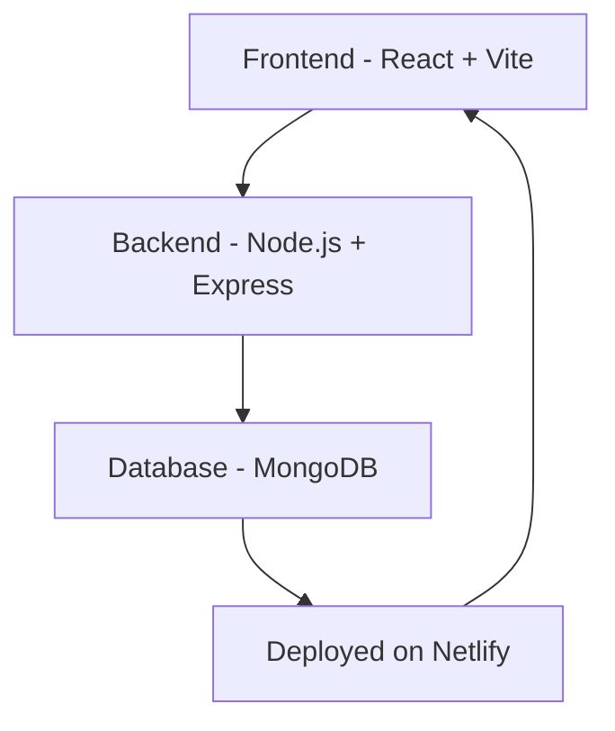

<h1 align="center">🎯 Event Management App 🎯</h1>

  
  
  
  

  <a href="https://event-management-shiwangi.netlify.app/" target="_blank">
    🔗 <strong>View Live Project</strong>
  </a>

---

## 🌟 About The Project

The **Event Management App** is a full-stack **MERN** application **designed, developed, and deployed entirely by Shiwangi Maurya**.  
It showcases her expertise across the **complete development cycle** — from UI/UX design to backend API integration and production deployment.

> 💡 This project demonstrates Shiwangi’s solid command of React, Node.js, Express, MongoDB, and cloud deployment — building a fully responsive, efficient, and scalable event management platform.

---

## 🧠 Purpose

The app enables users to:

- Create, view, and manage events dynamically.
- Experience real-time updates with a smooth user interface.
- Explore modern, responsive, and high-performance full-stack development built from scratch.

---

## ⚙️ Tech Stack

| Area                | Technology                                             |
| ------------------- | ------------------------------------------------------ |
| **Frontend**        | React.js, Vite, Tailwind CSS, HTML5, JavaScript (ES6+) |
| **Backend**         | Node.js, Express.js                                    |
| **Database**        | MongoDB with Mongoose                                  |
| **Deployment**      | Netlify (Frontend)                                     |
| **Version Control** | Git & GitHub                                           |

---

## 🚀 Key Features

- 🎉 **Event Creation & Management** – Add, edit, and delete events dynamically with instant UI updates.
- 🔍 **Search & Filter Functionality** – Quickly locate events by category, date, or name.
- ⚙️ **Dynamic API Integration** – Full CRUD functionality powered by Express.js and MongoDB.
- 🧱 **Modular Architecture** – Clean folder structure for easy scalability and maintenance.
- ⚡ **Optimized Performance** – Vite ensures fast build times and smooth rendering.
- 📱 **Fully Responsive Design** – Built with Tailwind CSS to adapt seamlessly across all devices.
- 🚀 **Deployed & Hosted** – Independently deployed by Shiwangi on **Netlify**, demonstrating cloud deployment expertise.

---

## 🧩 Project Structure

---

## 🧭 Project Workflow

